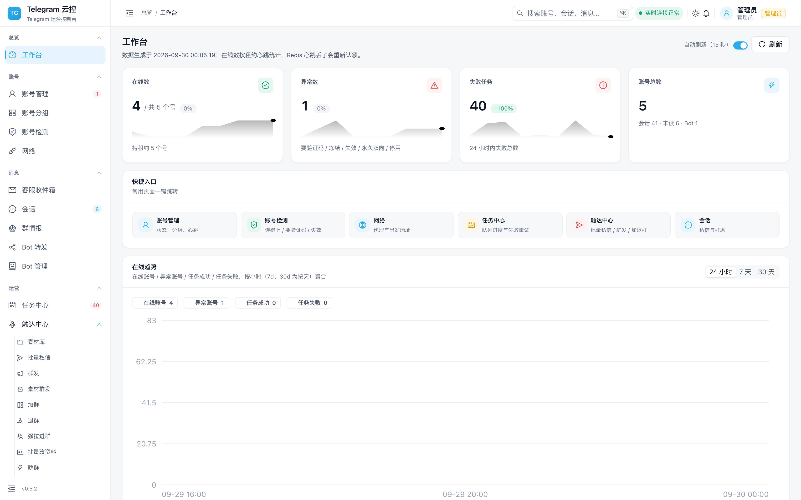
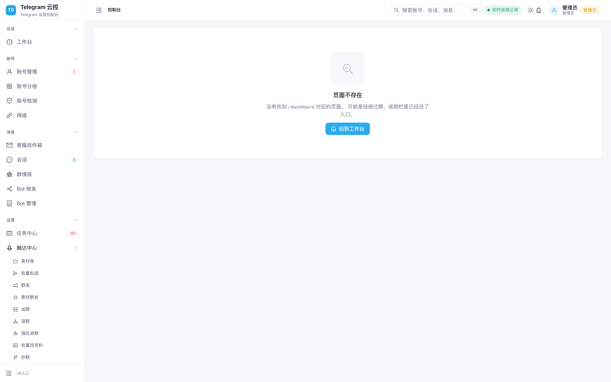
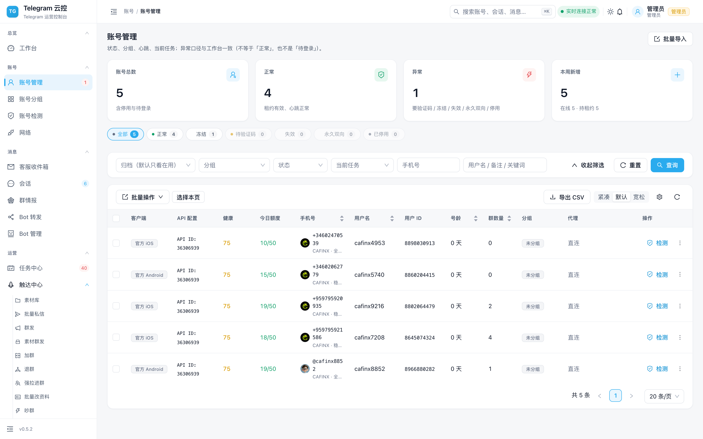
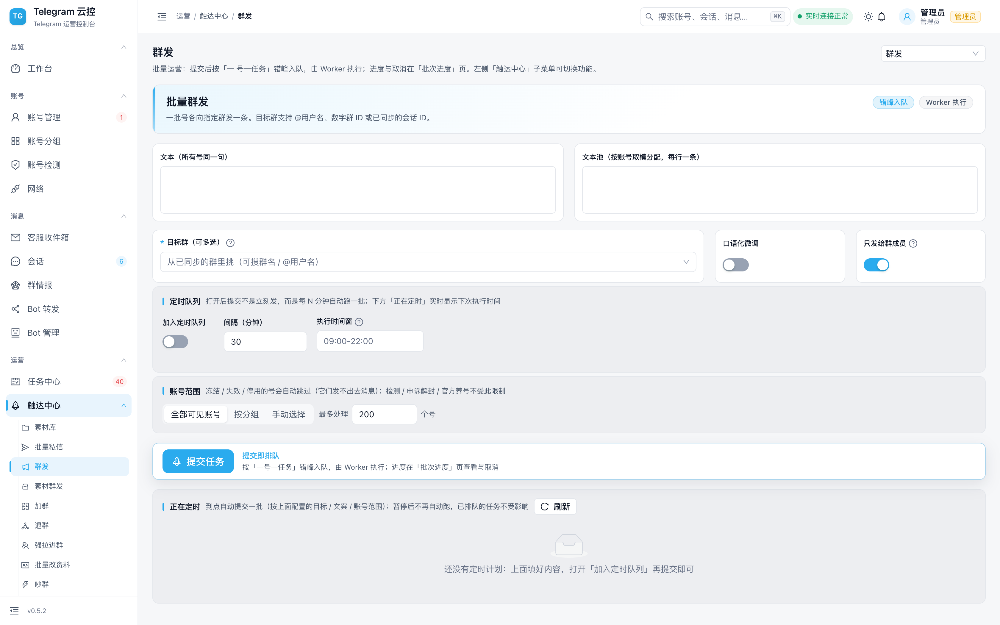
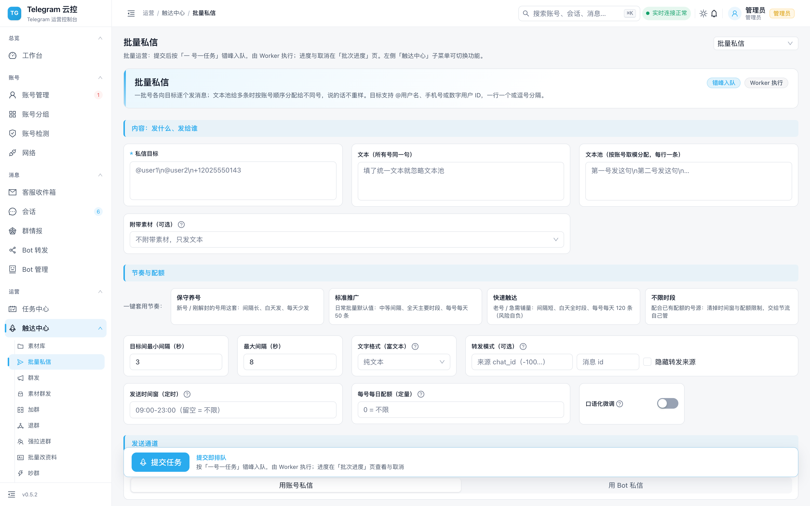
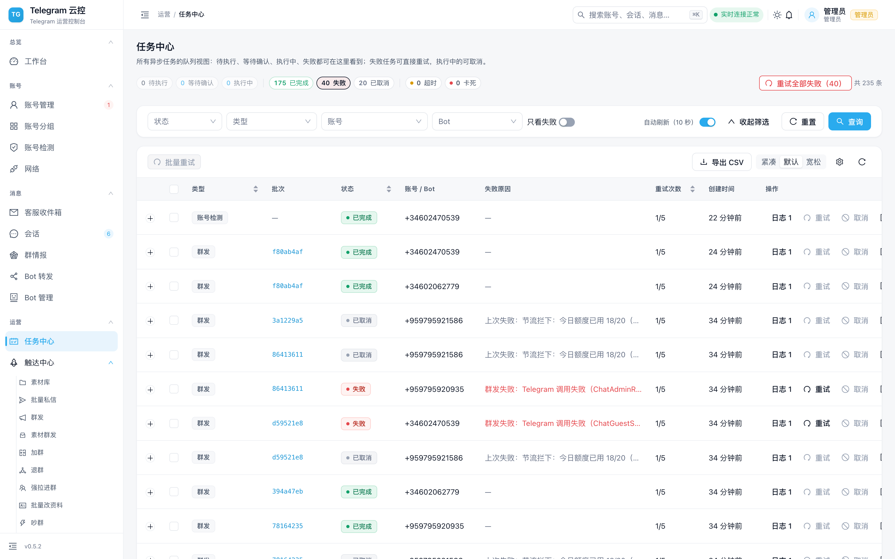

<div align="center">


<h1>Telegram 云控</h1>

<p><b>面向自有账号与官方 Bot 的 Telegram 运维控制台</b><br>
在线状态 · 会话收件箱 · 任务队列 · Bot 转发 · 全链路审计</p>

<p>
  <a href="https://github.com/cafinxnull/telegram-cloud-control-release/releases"></a>
  <a href="https://github.com/cafinxnull/telegram-cloud-control-release/stargazers"></a>
  <a href="https://github.com/cafinxnull/telegram-cloud-control-release/issues"></a>
  <a href="https://github.com/cafinxnull/telegram-cloud-control-release/commits/main"></a>
  <a href="https://t.me/TGCloudcontrol"></a>
  
  <a href="https://github.com/sponsors/cafinxnull"></a>
</p>

<p>
  
  
  
  
  
  
  
</p>

<p>
  
</p>

<p>
  <a href="#这是什么">说明</a> ·
  <a href="#包含--不包含">包含内容</a> ·
  <a href="#界面预览">截图</a> ·
  <a href="#快速开始">快速开始</a> ·
  <a href="#获取完整版">获取完整版</a> ·
  <a href="#赞助支持">赞助</a> ·
  <a href="#联系方式">联系</a> ·
  <a href="#文档">文档</a>
</p>

</div>

---

## 这是什么

**Telegram 云控的「可试用发行版」** —— 前端界面 + 完整部署文档，**开箱即可看到真实界面**。

> ⚠️ **本仓库不包含后端服务。** 后端（账号调度与风控核心）为商业部分，需**授权后提供**。
> 获取方式见 [**获取完整版**](#获取完整版)。

## 包含 / 不包含

| | 内容 |
| --- | --- |
| ✅ **包含** | 前端编译产物（已压缩混淆）、完整部署文档、`docker-compose` 与 `.env` 样例、更新记录 |
| ❌ **不包含** | 后端 API、Worker（Telegram 账号调度与风控核心） |

**把本包装起来后界面能打开，但登录与数据需要连接一个后端服务。**

## 界面预览

> 以下截图取自当前版本（`v0.5.4`），界面即实际形态。

<div align="center">

**登录**



**工作台** —— 在线概览、Worker 心跳、最近失败任务



**账号管理** —— 状态、健康分、设备身份、批量操作



**触达中心 · 批量群发** —— 一号一任务错峰入队



**触达中心 · 批量私信**



**任务中心** —— 按批次聚合，展开看实时执行日志



</div>

## 快速开始

```bash
# 1. 取环境变量样例，按注释填写（三个密钥上线必须替换）
cp deploy/.env.example deploy/.env

# 2. 前端产物在 web/，交给 nginx 或任意静态服务托管即可
#    后端地址在 .env 的 VITE_API_BASE（或反代规则）里指向你的实例

# 3. 详细步骤见部署文档
```

详见 **[GETTING_STARTED.md](docs/GETTING_STARTED.md)**（先跑起来）与
**[DEPLOYMENT.md](docs/DEPLOYMENT.md)**（正式上线）。

> **Linux 服务器部署必看**：**[LINUX_VERIFY.md](docs/LINUX_VERIFY.md)** —— 涉及浏览器依赖与环境验证。

## 获取完整版

**后端不开源** —— 这套系统的价值集中在账号调度、节流与稳定性处理上，把源码公开等于把工作成果直接送人。

需要**完整后端**、**二次开发**或**商业授权**，来 Telegram 交流群找我：

> **交流群：[t.me/TGCloudcontrol](https://t.me/TGCloudcontrol)**
>
> 进群说明来意（自用 / 商用 / 二次开发），我会按需求提供对应授权版本。

**授权范围**：自用部署不限账号数；商用与转售需单独洽谈。

## 部署前的必读事项

- **三个密钥上线必须替换**：`POSTGRES_PASSWORD` / `SECRET_KEY` / `SESSION_ENCRYPTION_KEY`。
  生成方式写在 `deploy/.env.example` 注释里。**密钥一旦有账号登录过就不能再改** —— 已入库的会话将解不开；
- **账号安全由部署者自行负责**：批量操作的频率上限、活跃时段、动作间隔请按自己的实际情况配置。
  系统内置节流与熔断保护，但它**不是免死金牌** —— 任何自动化操作都有风险；
- **数据全部留在你自己的服务器上**，不经过任何第三方。

<div align="center">

### 赞助商

<table>
  <tr>
    <td align="center" width="50%">
      <a href="https://cafinx.com">
        </a><br>
      <b><a href="https://cafinx.com">CAFINX 虚拟卡</a></b><br>
      <sub>跨境收付虚拟卡 · cafinx.com</sub>
    </td>
    <td align="center" width="50%">
      <a href="https://cafinxsim.com">
        </a><br>
      <b><a href="https://cafinxsim.com">CAFINXSIM</a></b><br>
      <sub>全球 eSIM 流量卡 · cafinxsim.com</sub>
    </td>
  </tr>
</table>

</div>

## 赞助支持

这个项目是持续维护的 —— 节流策略要跟着平台风控变化调整，协议一改就得跟进。

| 方式 | 入口 |
| --- | --- |
| **GitHub Sponsors** | [github.com/sponsors/cafinxnull](https://github.com/sponsors/cafinxnull) |
| **USDT（TRC20）** | `TYozr2b8tV4fikCuQYYvaHRCW555555555`　⚠️ **必须走 TRC20 网络** |
| **微信 / 支付宝** | 到 [交流群](https://t.me/TGCloudcontrol) 找我 |

**赞助者的需求优先处理**（提 issue、要功能、遇到问题都算）。

> ⚠️ USDT 用错链（ERC20 / BEP20 等）资产将无法找回，转账前请务必确认网络。

## 联系方式

| 渠道 | 地址 |
| --- | --- |
| **Telegram 交流群**（推荐，回得最快） | [t.me/TGCloudcontrol](https://t.me/TGCloudcontrol) |
| **GitHub Issues** | [提交问题](https://github.com/cafinxnull/telegram-cloud-control-release/issues) |

## 文档

| 文档 | 内容 |
| --- | --- |
| [文档索引](docs/README.md) | 按用途分类的全部文档 |
| [快速开始](docs/GETTING_STARTED.md) | 从产物到看见界面 |
| [部署](docs/DEPLOYMENT.md) | 正式部署与上线检查清单 |
| [Linux 环境验证](docs/LINUX_VERIFY.md) | 服务器部署必看 |
| [架构概览](docs/ARCHITECTURE.md) | 由哪些部分组成、数据怎么流转 |
| [功能清单](docs/FEATURES.md) | 完整功能列表与界面入口 |
| [安全说明](docs/SECURITY.md) | 密钥管理、访问控制、数据存放 |
| [更新记录](CHANGELOG.md) | 每个版本改了什么 |

## 许可

**核心源码为闭源商业成果，著作权归作者所有** —— 获得发行版**不等于**获得源码授权。

发行版可用于**自用部署与评估**；**禁止转售、去除标识、以衍生版提供商业服务**。

完整条款见 **[LICENSE](LICENSE)**（源码归属 / 授权范围 / 禁止事项 / 商用洽谈 / 免责）。

需要**商用、二次开发或源码授权**，到 [交流群](https://t.me/TGCloudcontrol) 洽谈。
